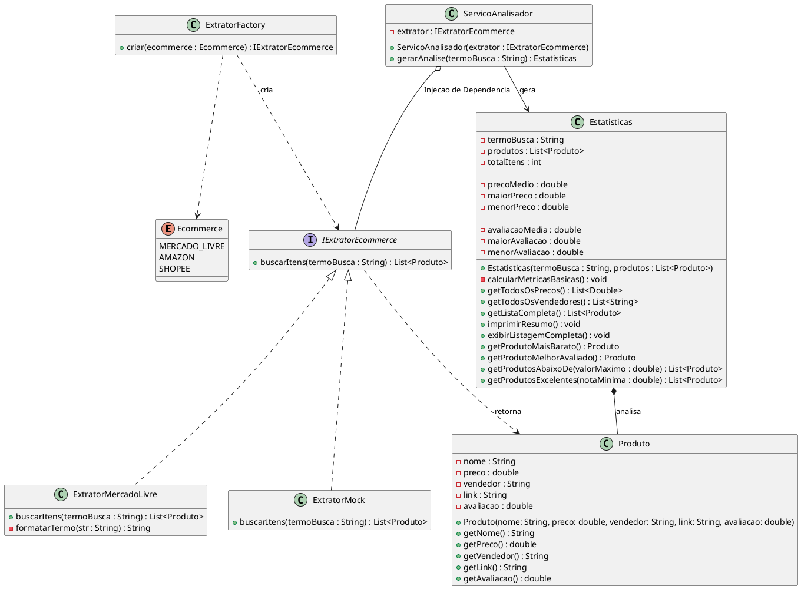

**Framework Analisador de E-commerce**

Um framework em Java construído para extrair, processar e analisar dados de produtos em marketplaces (como o Mercado Livre). O projeto foi desenvolvido com um forte foco em boas práticas de Programação Orientada a Objetos, aplicando princípios SOLID, Injeção de Dependência e o padrão de projeto Factory Method.

**Principais Funcionalidades**

Extração Automatizada: Recolha de títulos, preços, vendedores, links e notas de avaliação.

Análise Estatística: Cálculo automático de preços (médio, maior, menor) e avaliações.

Filtros Avançados: Funções prontas para filtrar produtos por orçamento máximo, nota mínima, fornecedores únicos, etc.


**Como Utilizar**

O framework foi concebido para ser simples de implementar em qualquer aplicação "cliente". Exemplo de utilização:

```java

import framework.factory.ExtratorFactory;
import framework.enums.Ecommerce;
import framework.extractor.IExtratorEcommerce;
import framework.service.ServicoAnalisador;
import framework.service.Estatisticas;

public class App {
    public static void main(String[] args) {
        // 1. Cria o extrator desejado usando a Factory
        IExtratorEcommerce extrator = ExtratorFactory.criar(Ecommerce.MERCADO_LIVRE);
        
        // 2. Injeta o extrator no Serviço Analisador
        ServicoAnalisador analisador = new ServicoAnalisador(extrator);
        
        // 3. Gera as estatísticas
        Estatisticas resultado = analisador.gerarAnalise("Vaio FE 16");
        
        // 4. Exibe os resultados
        resultado.imprimirResumo();
        
        // Produtos excelentes (Nota > 4.5)
        resultado.getProdutosExcelentes(4.5).forEach(p -> 
            System.out.println(p.getNome() + " - " + p.getAvaliacao() + " estrelas")
        );
    }

```

**Tecnologias Utilizadas**

Java (11+)

Playwright for Java: Utilizado para web scraping e automação de navegação.

JUnit 5: Cobertura de testes unitários com regras de validação (fail-fast).

Maven: Gestão de dependências e compilação do projeto.

Desenvolvido por Leonardo Dumes de Souza
